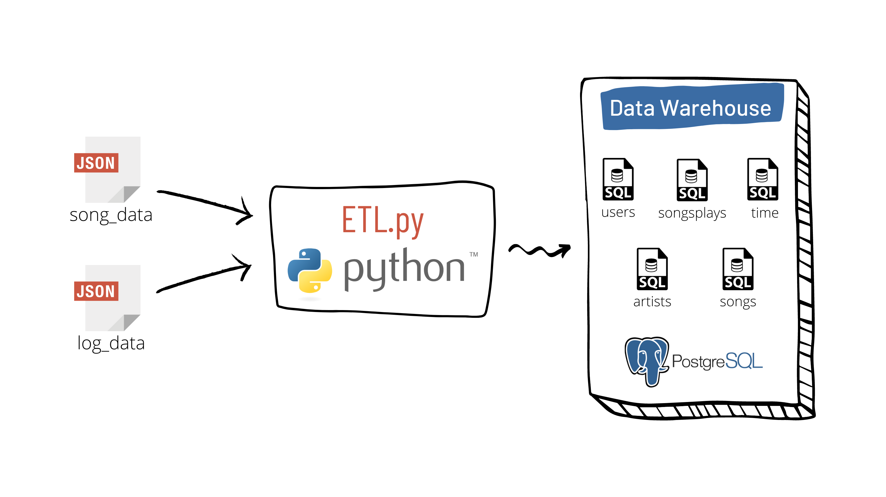

# Modelagem de dados com PostgreSQL

## Introdução

Esse é um projeto para praticar modelagem de dados com PostgreSQL.

Esse projeto ajuda o time de analytics de uma startup de streaming de música, chamada Sparkify, analisando seus dados de músicas e as atividades de usuários.

Definindo um star chema e escrevendo o pipeline ETL, os dados baseados em arquivos CSV são transferidos para uma base de dados para análises futuras. 

## Data Schema and ETL Pipeline

### Data Schema

Sparkify deseja analisar quais músicas os seus usários estão escutando.

Utilizando os conjuntos de dados songs e logs, foi criado um star schema como mostrado abaixo, que inclui

- Uma tabela fato: **songplays**, e 
- Quatro tabelas dimensões: **users**, **songs**, **artists** and **time**.

### ETL Pipeline

O ETL pipeline extrai os dados dos arquivos `song_data.json` e `log_data.json` e faz a inserção nas tabelas do PostgreSQL utilizando o script `etl.py`, como você pode observar na imagem abaixo

## Como executar

### Pré-requisitos

Se você deseja executar esse projeto em sua máquina, você deve finalizar os seguintes passos primeiro.

- Instalar `PostgreSQL` em localhost
- Criar usuário `postgres` com senha `admin`
- Criar base de dados `sparkifydb`

### Instruções

1. Criar database/tablelas: `python create_tables.py`
2. Enviar os dados dos arquivos, armazenando na base de dados: `python etl.py`
3. Confira o resultado do processo: Execute as queries, individualmente, do arquivo `test.sql` no PostgreSQL para visualizar se os dados foram registrados corretamente nas tabelas.

## Arquivos do projeto

- **data**
  - **log_data**
    - dados de ações dos usuários no app (Ex: Quais músicas eles estão escutando)
  - **song_data**
    - dados sobre as músicas e os artistas
- **images**
  - Imagens do documento
- **create_tables.py**
  - Quando executado, esse script irá
    - `drop` database `sparkifydb`
    - `create` database `sparkifydb`
    - `drop` tables if exists
    - `create` tables if not exists
- **etl.py**
  - Script para implementaçao do processo de ETL
  - Quando executado, esse script irá 
    - Iterar entre todos arquivos dentro de data/song_data para extrair os dados de songs/artists e inserir na base de dados do PostgreSQL
    - Iterar entre todos arquivos dentro de data/log_data para extrair os dados de user/time/songplays e inserir na base de dados do PostgreSQL
- **README.md**
  - Descrição e instruções sobre o projeto
- **sql_queries.py**
  - Contém todas instruções DLL definidas
- **test.sql**
  - Queries para testar se as tabelas foram populadas corretamente
